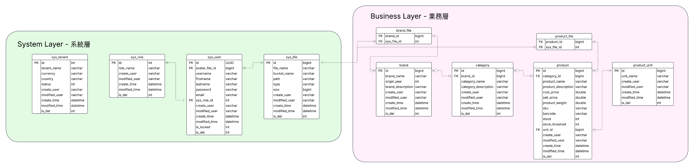

<a id="readme-top"></a>

<div align="center">

<!-- [![Contributors][contributors-shield]][contributors-url] -->
<!-- [![Forks][forks-shield]][forks-url] -->
<!-- [![Stargazers][stars-shield]][stars-url] -->
[![Issues][issues-shield]][issues-url]
[![project_license][license-shield]][license-url]
<!-- [![LinkedIn][linkedin-shield]][linkedin-url] -->


</div>

<br />
<div align="center">
  <a href="https://github.com/ChrisioGwaan/wenxige-bg">
    
  </a>

<h3 align="center">Guangzhou Wenxige Trading Co., Ltd. Admin Management System</h3>
<h3 align="center">广州文熙阁贸易有限公司管理系统</h3>

  <p align="center">
    This is the backend service for Guangzhou Wenxige Trading Co., Ltd. Admin Management System. Previously, we chose to use Spring Boot as the backend framework for this project. However, we have since shifted our focus to a more lightweight solution using Flask. This decision was made to enhance the performance and efficiency of our application.
    <br />
    <br />
    <!-- <a href="https://github.com/github_username/repo_name">API Demo</a>
    &middot; -->
    <a href="https://github.com/ChrisioGwaan/wenxige-bg/issues/new?labels=bug&template=bug-report---.md">Report Bug</a>
    &middot;
    <a href="https://github.com/ChrisioGwaan/wenxige-bg/issues/new?labels=enhancement&template=feature-request---.md">Request Feature</a>
  </p>
</div>

<details>
  <summary>Table of Contents</summary>
  <ol>
    <li>
      <a href="#about-the-project">About The Project</a>
      <ul>
        <li><a href="#built-with">Built With</a></li>
      </ul>
    </li>
    <li>
      <a href="#getting-started">Getting Started</a>
      <ul>
        <li><a href="#prerequisites">Prerequisites</a></li>
        <li><a href="#installation">Installation</a></li>
      </ul>
    </li>
    <li><a href="#project-structure-flask">Project Structure (Flask) </a></li>
    <li><a href="#project-structure-spring-boot">Project Structure (Spring Boot)</a></li>
    <li><a href="#database-design">Database Design</a></li>
    <li><a href="#roadmap">Roadmap</a></li>
    <li><a href="#contributing">Contributing</a></li>
    <li><a href="#license">License</a></li>
    <li><a href="#contact">Contact</a></li>
  </ol>
</details>

## About The Project

This is the backend service for Guangzhou Wenxige Trading Co., Ltd. Admin Management System. We will continue to develop the system using Spring Boot for scalability and performance.

<p align="right">(<a href="#readme-top">📍back to top</a>)</p>

### Built With

* [![Spring][Spring.com]][Spring-url]
* [![Java][Java.com]][Java-url]
* [![MySQL][MySQL.com]][MySQL-url]
* [![Flask][Flask.com]][Flask-url]
* [![Python][Python.com]][Python-url]

<p align="right">(<a href="#readme-top">📍back to top</a>)</p>

## Getting Started

### Prerequisites

* **Python 3.8 or higher**
* **Git**
* **Java 21**
* **Maven 3.8 or higher**
* **Postman** (Optional, for testing APIs)
* **DbVisualizer** (Optional, for database management)

### Installation

> Flask

1. Clone the repo
   ```sh
   git clone https://github.com/ChrisioGwaan/wenxige-bg.git
   ```
2. Direct to the project directory
   ```sh
   cd wenxige-bg/flask-bg
   ```
3. Create a virtual environment (If you have done it already, you can skip this step next time)
   ```sh
   python -m venv venv
   ```
4. Activate the virtual environment
   ```sh
   # For Windows
   venv\Scripts\activate
   # For macOS/Linux
   source venv/bin/activate
   ```
5. Install dependencies
   ```sh
    pip install -r requirements.txt
    ```
6. Run the application
    ```sh
    python run.py
    ```
   
> Spring Boot

1. Clone the repo
   ```sh
   git clone https://github.com/ChrisioGwaan/wenxige-bg.git
    ```

2. Open the project in your IDE (e.g., IntelliJ IDEA, Eclipse).

3. Wait for the IDE to download the required dependencies.

<p align="right">(<a href="#readme-top">📍back to top</a>)</p>

## Project Structure (Flask)

```
wenxige-bg
├── .env.example                    - Environment variables example, please rename it to .env and fill in the values
├── .gitignore                      - Git ignore file
├── README.md                       - This file
├── app                             - Main application directory
│   ├── __init__.py                 - Application initialization
│   ├── config.py                   - Configuration settings
│   ├── controllers                 - Contains all controllers for the application
│   │   ├── __init__.py             - Controller initialization
│   │   ├── main_controller.py      - Main controller for the application
│   │   ├── routes.py               - Routes for the application
│   │   └── sys_user_controller.py  - User controller for the application
│   ├── enums.py                    - Enumeration definitions
│   ├── extensions.py               - Extensions for Flask
│   ├── http_status.py              - HTTP status codes
│   ├── models                      - Contains all data models
│   │   ├── __init__.py             - Model initialization
│   │   └── sys_user.py             - User model definitions
│   ├── schemas                     - Contains all data schemas
│   │   ├── __init__.py             - Schema initialization
│   │   └── sys_user_schema.py      - User schema definitions
│   ├── services                    - Contains all service logic
│   │   ├── __init__.py             - Service initialization
│   │   └── sys_user_service.py     - User service logic
│   └── utils                       - Contains utility functions
│       ├── __init__.py             - Utility initialization
│       └── response_utils.py       - Response utility functions
├── requirements.txt                - Python dependencies
├── run.py                          - Entry point for the application
├── tests                           - Contains all test cases
│   ├── __init__.py                 - Test initialization
│   └── test_users.py               - User test cases
└── vercel.json                     - Vercel configuration file
```

## Project Structure (Spring Boot)

```
E:\repo2\wenxige-bg
├── db
│   └── schema.sql                        - Database schema file
├── pom.xml                               - Maven configuration file
└── wenxige-bg-service
    ├── src/main/java/com/wenxige/bg
    │   ├── WenxigeBgApplication.java     - Main application entry point
    │   ├── config                        - Configuration directory
    │   ├── controller                    - Contains all controllers for the application
    │   ├── dto                           - Data Transfer Objects
    │   ├── entity                        - Contains all data models
    │   ├── enums                         - Enumeration definitions
    │   ├── jwt                           - JWT authentication
    │   ├── mapper                        - MyBatis mapper interfaces
    │   ├── service                       - Contains all service logic
    │   ├── util                          - Contains utility functions
    │   └── vo                            - View Objects
    └── resources
        ├── application.yml               - Application configuration file
        ├── log4j.properties              - Logging configuration file
        ├── mapper                        - MyBatis XML mapper files
        └── templates                     - Thymeleaf templates
```

<p align="right">(<a href="#readme-top">📍back to top</a>)</p>

## Database Design



<p align="right">(<a href="#readme-top">📍back to top</a>)</p>

## Roadmap

- Please check #10 for the roadmap of the project.

See the [open issues](https://github.com/ChrisioGwaan/wenxige-bg/issues) for a full list of proposed features (and known issues).

<p align="right">(<a href="#readme-top">📍back to top</a>)</p>

## Contributing

Contributions are what make the open source community such an amazing place to learn, inspire, and create. Any contributions you make are **greatly appreciated**. Please check [Code of Conduct](CODE_OF_CONDUCT.md) for more information.

If you have a suggestion that would make this better, please fork the repo and create a pull request. You can also simply open an issue with the tag "enhancement".
Don't forget to give the project a star! Thanks again!

1. Fork the Project
2. Create your Feature Branch (`git checkout -b feature/AmazingFeature`)
3. Commit your Changes (`git commit -m 'Add some AmazingFeature'`)
4. Push to the Branch (`git push origin feature/AmazingFeature`)
5. Open a Pull Request

<p align="right">(<a href="#readme-top">📍back to top</a>)</p>

### Top contributors:

<a href="https://github.com/ChrisioGwaan/wenxige-bg/graphs/contributors">
  
</a>

## License

Distributed under the project_license. See [LICENSE](LICENSE) for more information.

<p align="right">(<a href="#readme-top">📍back to top</a>)</p>

## Contact

Weixi (Chrisio) Guan - [Portfolio](https://www.chrisiogwaan.com) - chris322322@gmail.com

<br />Project Link: [https://github.com/ChrisioGwaan/wenxige-bg](https://github.com/ChrisioGwaan/wenxige-bg)

<p align="right">(<a href="#readme-top">📍back to top</a>)</p>


<!-- MARKDOWN LINKS & IMAGES -->
<!-- https://www.markdownguide.org/basic-syntax/#reference-style-links -->
<!-- [contributors-shield]: https://img.shields.io/github/contributors/github_username/repo_name.svg?style=for-the-badge
[contributors-url]: https://github.com/github_username/repo_name/graphs/contributors
[forks-shield]: https://img.shields.io/github/forks/github_username/repo_name.svg?style=for-the-badge
[forks-url]: https://github.com/github_username/repo_name/network/members
[stars-shield]: https://img.shields.io/github/stars/github_username/repo_name.svg?style=for-the-badge
[stars-url]: https://github.com/github_username/repo_name/stargazers -->
[issues-shield]: https://img.shields.io/github/issues/ChrisioGwaan/wenxige-bg.svg?style=for-the-badge
[issues-url]: https://github.com/ChrisioGwaan/wenxige-bg/issues
[license-shield]: https://img.shields.io/github/license/ChrisioGwaan/wenxige-bg.svg?style=for-the-badge
[license-url]: https://github.com/ChrisioGwaan/wenxige-bg/blob/feature/LICENSE
[Spring.com]: https://img.shields.io/badge/Spring-6DB33F?style=for-the-badge&logo=spring&logoColor=white
[Spring-url]: https://spring.io/projects/spring-framework
[Java.com]: https://img.shields.io/badge/Java-ED8B00?style=for-the-badge&logo=openjdk&logoColor=white
[Java-url]: https://www.java.com/en/
[MySQL.com]: https://img.shields.io/badge/MySQL-4479A1?style=for-the-badge&logo=mysql&logoColor=white
[MySQL-url]: https://www.mysql.com/
[Flask.com]: https://img.shields.io/badge/Flask-000000?style=for-the-badge&logo=flask&logoColor=white
[Flask-url]: https://flask.palletsprojects.com/en/2.3.x/
[Python.com]: https://img.shields.io/badge/Python-3776AB?style=for-the-badge&logo=python&logoColor=white
[Python-url]: https://www.python.org/
